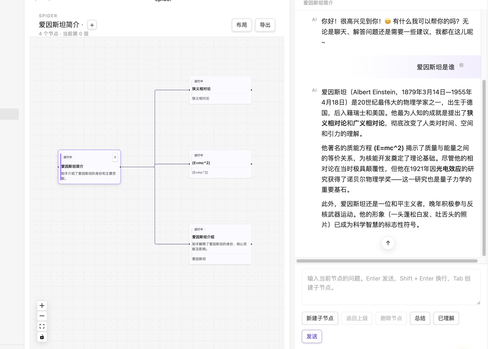

# Spider（蜘蛛图谱）

[](https://github.com/111pointer111/spider/releases/latest)
[](https://github.com/111pointer111/spider/releases)
[](LICENSE)
[](https://obsidian.md)
[](https://github.com/obsidianmd/obsidian-releases/blob/master/community-plugins.json)

> 🌏 **其他语言**: [English](README.md)

**AI 对话像蛛网一样自然展开——按 `Tab` 键从任意回答拉出新分支，让追问、对比、回溯成为肌肉记忆。**

一个 Obsidian 插件，把 ChatGPT / Claude / DeepSeek / 任何 OpenAI 兼容 API 的对话装进**可分支的节点图**。读完 AI 回答、遇到不熟的术语，选中文字按 `Tab`，自动生成子节点继续追问——无限深度、随时回退、最终一键导出为 Obsidian Canvas / Markdown / Mermaid 思维导图。



> 🎬 **想要看动态演示？** 这里应该有 GIF——录一段 5 秒的 Tab 分支演示，放到 `.github/demo.gif` 并替换上面这张静态图。详见 [录制动图](#-录制动图)。

---

## 🤔 为什么需要 Spider？

| 场景 | 普通 AI 对话 | Spider |
|---|---|---|
| 读到一半想深入追问一个术语 | 复制粘贴 → 新开窗口 → 丢失原对话线索 | 选中文字 → `Tab` → 子节点自动带上下文 |
| 同一个问题想对比几种提问方式 | 开 N 个标签页来回切 | 同一节点下挂多个子节点，左右对照 |
| 探索完想把对话留作笔记 | 复制粘贴到笔记里，链接断裂 | 一键导出 Markdown + Canvas + Mermaid 完整包 |
| 想让 AI 回答像 Notion AI 一样嵌在文档里 | 切窗口来回复制 | 全程不离开 Obsidian |

> **vs Copilot 插件**：Copilot 是单线程聊天机器人；Spider 是多线程**知识图谱**——同样聊一个话题，Copilot 给你一条线，Spider 给你一棵树。

---

## ⚡ 30 秒上手

1. **安装**：Settings → Community plugins → Browse → 搜 `spider` → Enable
2. **配置 API Key**：Settings → Spider → 填 `apiBaseUrl` + `apiKey` + `model`（任何 OpenAI 兼容端点都行）
3. **新建一张图**：ribbon 上的 spider 图标（或命令面板 `Spider: New map`）→ 开始聊天
4. **试试 Tab 分支**：AI 回答里选中一段文字，按 `Tab` —— 就这么简单

---

## ✨ 核心特性

### 🌳 无限分支的对话
- **没有深度上限**：想追问多深就追问多深，图会跟着长
- **父上下文自动带入**：子节点的问题发到 AI 时，自动带上父节点的标题/摘要/锚点
- **流式响应**：打字机式的实时渲染，Markdown / 代码块同步高亮
- **选中即分支**：AI 回答里高亮任意文字 → `Tab` → 子节点的"原文锚点"就是这段高亮
- **辅助动作**：重试、总结、AI 自动起标题

### 🕸️ 交互式知识图谱
- **全标签页画布**（React Flow 驱动）
- **点击节点切换上下文**，右侧聊天面板自动跟随
- **折叠 / 展开子树**：大图也能保持清爽
- **自动布局**（Dagre 算法），路径自动高亮
- **拖拽节点**：位置持久化，下次打开还是你摆的样子

### 📦 一键导出完整包

```
Spider Maps/
  ├── README.md                 # 包总览
  ├── index.md                  # Obsidian 入口笔记
  ├── nodes/                    # 每个节点一份独立 md
  ├── diagrams/mindmap.mermaid.md
  ├── canvas/map.canvas         # 可视化知识图谱
  └── data/map.json             # 原始数据（可重新导入）
```

- Canvas 节点带颜色编码（紫色=根 / 绿色=已理解 / 灰色=已归档 / 蓝色=进行中）
- 边带标签（锚点文字 / 首个问题摘要），方向箭头清晰
- Markdown 之间双向链接 + 回链，构建完整思考链

### 🔌 兼容任何 OpenAI 兼容 API
- **官方 OpenAI**（`https://api.openai.com/v1`）
- **DeepSeek / Moonshot / 通义千问 / 智谱 GLM**（OpenAI 兼容模式）
- **OpenRouter / Together / Groq**（聚合 API）
- **本地 LLM**：Ollama、vLLM、LM Studio 的 OpenAI 兼容模式
- **通过代理的 Anthropic Claude**

> 💡 鉴于是 OpenAI 兼容端点，你只需要填 base URL 和 key，model 填你想用的那个。

### 🔐 隐私 & 网络声明
- 插件**需要联网**才能调用 AI，但你完全掌控调用哪个端点
- **API key 仅存本地**（Obsidian 插件的 data.json），不上传任何地方
- **不发 vault 全文**：只发当前节点的消息 + 可选的父上下文 + 可选的锚点文字
- **图谱数据 100% 本地**：所有地图存为 `.spider/maps/*.json`，可被 Obsidian 同步
- **离线可用**：知识图谱、导航、导出、查看历史全部不依赖网络，只有"发送消息"需要

### 🌐 中英双语
界面在中文 / English 之间随时切换。**导出物刻意保持中文硬编码**——导出的是历史档案，不能因为切语言就把旧 md 改写。

---

## ⌨️ 快捷键速查

| 按键 | 作用 |
|---|---|
| `Tab` | 在 AI 回答里选中文字后按 Tab → 生成子节点；无选中时按 Tab → 生成空子节点 |
| `Shift + Tab` | 回到父节点 |
| `← →` | 父节点 ↔ 第一个子节点 |
| `↑ ↓` | 兄弟节点之间穿梭 |
| `Enter` | 发送消息（在输入框） |
| `Shift + Enter` | 换行（在输入框） |
| `Esc` | 清除当前选区 |
| `Delete` / `Backspace` | 删除当前节点（非根节点，且焦点不在输入框时） |

---

## ⚙️ 配置项

| 设置 | 说明 | 默认值 |
|---|---|---|
| API Base URL | OpenAI 兼容端点 | `https://api.openai.com/v1` |
| API Key | 你的 API key（密码输入框，本地存储） | — |
| Model | 该端点支持的任意模型名 | `gpt-4o-mini` |
| Interface Language | 中文 / English | 中文 |
| Include parent context | 子节点请求是否带父节点的标题/摘要/锚点 | ✅ 开 |
| Include full context | 父节点所有历史消息也带过去（更费 token） | ❌ 关 |
| Stream responses | 流式响应 | ✅ 开 |
| Tab to create child nodes | Tab 键开关 | ✅ 开 |
| Auto-summarize nodes | AI 自动给节点生成摘要 | ❌ 关 |
| Default export folder | 导出包目录 | `Spider Maps` |

---

## 📥 安装

### 商店安装（推荐）
1. Obsidian → **Settings** → **Community plugins**
2. 关闭 Safe mode（如果是开的）
3. **Browse** → 搜 `spider` → **Install** → **Enable**
4. Settings → **Spider** → 填 API key 和 model

### 从源码安装（开发）
```bash
git clone https://github.com/111pointer111/spider
cd spider
npm install
npm run build
# 把 main.js, manifest.json, styles.css 复制到
# <vault>/.obsidian/plugins/spider/
# 然后在 Obsidian 里启用插件
```

或者用 `npm run link` 自动建 symlink 到你的 vault，配合 `npm run dev` 实现改代码即生效。

---

## 🛠 开发

```bash
npm install        # 安装依赖
npm run dev        # watch 模式（esbuild）
npm run build      # 生产构建（含 tsc --noEmit 类型检查）
npm test           # 跑 vitest 测试
npm run link       # 把构建产物 symlink 到 vault
```

### 项目结构

```
src/
  ai/          OpenAI 兼容 API provider（流式 + 同步 + summarize）
  domain/      ChatMap 不可变工厂 + 树操作 + 守卫 + Dagre 布局
  export/      Markdown / Mermaid / Canvas / JSON 四种格式导出
  state/       多视图会话管理 + 单会话 ViewState
  storage/     Vault 内 JSON 持久化（兼容旧目录）
  ui/          React 组件（图、聊天面板、画廊、弹窗）
  utils/       ID 生成、路径处理、activeDocument 兼容垫片
tests/         vitest 单测（领域层 + 导出层 + AI 层）
__mocks__/     Obsidian API 的桩模块（让 vitest 跑得起来）
```

### 🎥 录制动图

> 🎬 如果你想贡献一段演示动图：
> 1. 用 [Kap](https://getkap.co/) (macOS) / [ScreenToGif](https://www.screentogif.com/) (Windows) / `ffmpeg` (Linux) 录一段 5–10 秒的操作
> 2. 展示：开 spider → 问个问题 → AI 回答里选中一段文字 → 按 Tab → 出现子节点 → 继续追问
> 3. 导出为 GIF，放到 `.github/demo.gif`
> 4. PR 到本仓库，把第一张图换成 ``

---

## 🧭 路线图（想到就写）

- [ ] 节点全文搜索（Ctrl/Cmd+F 替代）
- [ ] 多选节点 + 批量操作
- [ ] 节点引用 / 反向链接（自动追踪"哪个节点引用了我"）
- [ ] 自定义 system prompt
- [ ] 导出时可选附 AI 摘要

---

## 📜 许可证

[MIT](LICENSE)

---

## 🙏 致谢

- [Obsidian](https://obsidian.md) — 这个疯狂可扩展的笔记应用
- [React Flow (@xyflow/react)](https://reactflow.dev/) — 画布引擎
- [@dagrejs/dagre](https://github.com/dagrejs/dagre) — 自动布局
- [费曼学习法](https://en.wikipedia.org/wiki/Feynman_technique) — 用"能给别人讲清楚"作为理解标准